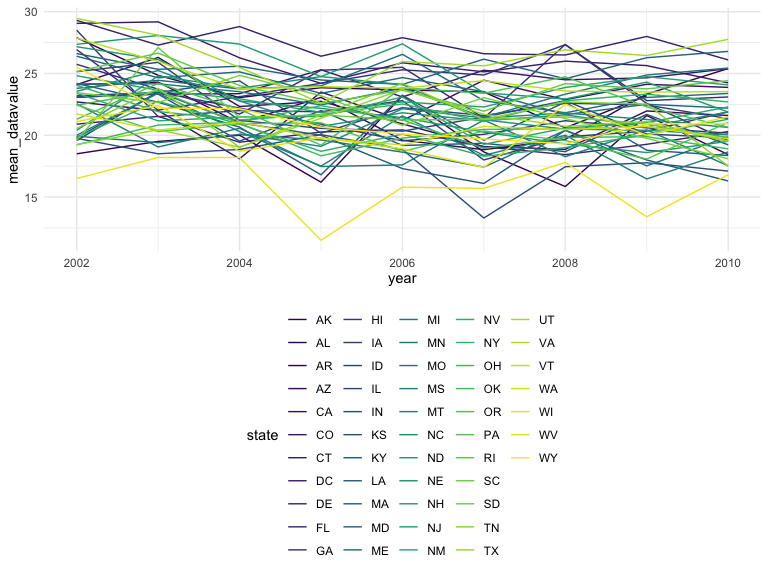
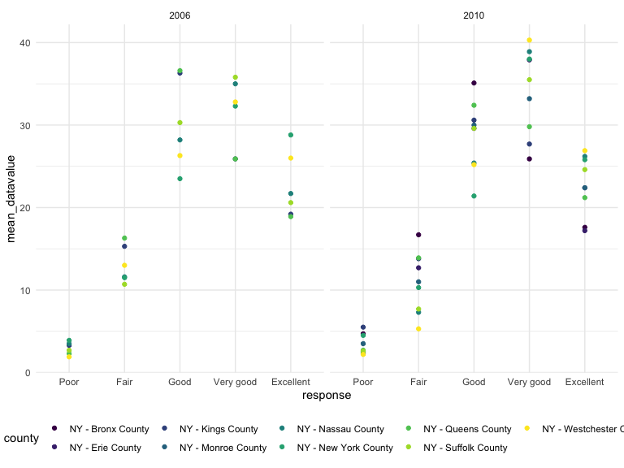
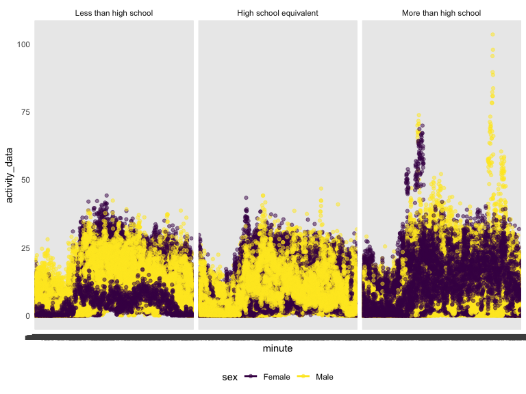

p8105_hw3_mcm2335
================
Madeleine McGuinness
2023-10-27

# Problem 1

## Data Import

``` r
data("instacart")

instacart = instacart |>
  as_tibble()
```

This dataset contains 1384617 rows and 15 columns. Each row represents a
product from an individual order. There are variables descriping the
item itself, product name, aisle ID, aisle, department ID, and
department, and variables describing the order, including the day of
order, days since order, and hour of day.  
\## Data Tidying

# Problem 2

## Data Import & Tidying

``` r
data("brfss_smart2010")

brfss_smart2010 <- brfss_smart2010 |>
  as_tibble()

class(brfss_smart2010)
```

    ## [1] "tbl_df"     "tbl"        "data.frame"

``` r
brfss_smart2010 <- brfss_smart2010 |>
  janitor::clean_names() |>
  rename(state = locationabbr,
         county = locationdesc) |>
  select(year, state, county, class, topic, question, response, data_value) |>
  filter(topic == "Overall Health") |>
  filter(response == "Excellent" | response == "Very good" | response == "Good" | response == "Fair" | response == "Poor") |>
  mutate(response = factor(response, levels = c("Poor", "Fair", "Good", "Very good", "Excellent")))
```

## Data Visualization

``` r
distinct_counties <- brfss_smart2010 |>
  group_by(state, year) |>
  summarise(n_counties = n_distinct(county)) |>
  filter(year == 2010) |>
  filter(n_counties >= 7) 
```

    ## `summarise()` has grouped output by 'state'. You can override using the
    ## `.groups` argument.

``` r
# 6 states were observed at 7 or more locations in 2002, and 14 were observed at 7 or more locations in 2010

excellent <- brfss_smart2010 |>
  filter(response == "Excellent") |>
  group_by(state, year, response) |>
  summarise(mean_datavalue = mean(data_value, na.rm = TRUE))
```

    ## `summarise()` has grouped output by 'state', 'year'. You can override using the
    ## `.groups` argument.

``` r
excellent_plot <- excellent |>
  ggplot(aes(x = year, y = mean_datavalue, color = state)) +
  geom_line()

print(excellent_plot)
```



``` r
# the mean data value for excellent responses appears to be relatively consistent for all states across the 2002-2010 time period, with mean data values on average falling between 15 and 30.

ny <- brfss_smart2010 |>
  filter(state == "NY") |>
  filter(year == 2006 | year == 2010) |>
  group_by(county, year, response) |>
  summarise(mean_datavalue = mean(data_value, na.rm = TRUE))
```

    ## `summarise()` has grouped output by 'county', 'year'. You can override using
    ## the `.groups` argument.

``` r
ny_plot <- ny |>
  ggplot(aes(x = response, y = mean_datavalue, color = county )) +
  geom_point() +
  facet_grid(~year)

print(ny_plot)
```



``` r
#the distribution in mean data value for poor-excellent health appears to be pretty similar across the different New York counties in 2006 and 2010, with potentially slightly more variation in 2010.
```

# Problem 3

## Data Import and Tidying

``` r
nhanes_covar <- read_csv("./data/nhanes_covar.csv", skip = 4) |>
  janitor::clean_names() |>
  drop_na() |>
  filter(age >= 21) |>
  mutate(sex = if_else(sex == 1, "Male", "Female")) |>
  mutate(education = if_else(education == 1, "Less than high school", if_else(education == 2, "High school equivalent", "More than high school"))) |>
  mutate(education = factor(education, levels = c("Less than high school", "High school equivalent", "More than high school")))
```

    ## Rows: 250 Columns: 5
    ## ── Column specification ────────────────────────────────────────────────────────
    ## Delimiter: ","
    ## dbl (5): SEQN, sex, age, BMI, education
    ## 
    ## ℹ Use `spec()` to retrieve the full column specification for this data.
    ## ℹ Specify the column types or set `show_col_types = FALSE` to quiet this message.

``` r
nhanes_accel <- read_csv("./data/nhanes_accel.csv") |>
  janitor::clean_names() |>
  pivot_longer(min1:min1440,
               names_to = "minute",
               values_to = "activity_data")
```

    ## Rows: 250 Columns: 1441
    ## ── Column specification ────────────────────────────────────────────────────────
    ## Delimiter: ","
    ## dbl (1441): SEQN, min1, min2, min3, min4, min5, min6, min7, min8, min9, min1...
    ## 
    ## ℹ Use `spec()` to retrieve the full column specification for this data.
    ## ℹ Specify the column types or set `show_col_types = FALSE` to quiet this message.

``` r
merged_nhanes <- left_join(nhanes_covar, nhanes_accel, by = "seqn")

nhanes_accel_grouped <- merged_nhanes |>
  group_by(seqn, education, sex) |>
  summarise(mean_activityscore = mean(activity_data, na.rm = TRUE))
```

    ## `summarise()` has grouped output by 'seqn', 'education'. You can override using
    ## the `.groups` argument.

## Data Visualization

``` r
count_gender <- nhanes_accel_grouped |>
  group_by(education) |>
  count(sex) |>
  knitr::kable(digits = 2)

print(count_gender)
```

    ## 
    ## 
    ## |education              |sex    |  n|
    ## |:----------------------|:------|--:|
    ## |Less than high school  |Female | 28|
    ## |Less than high school  |Male   | 27|
    ## |High school equivalent |Female | 23|
    ## |High school equivalent |Male   | 35|
    ## |More than high school  |Female | 59|
    ## |More than high school  |Male   | 56|

``` r
# there are 28 females and 27 males in the less than high school group, 23 females and 35 males in the high school equivalent group, and 59 females and 56 males in the more than high school group

plot_activity <- merged_nhanes |>
  group_by(seqn, age, sex, education) |>
  summarise(mean_activityscore = mean(activity_data, na.rm = TRUE)) |>
  ggplot(aes(x = age, y = mean_activityscore, color = sex )) +
  geom_point() +
  geom_smooth(se = FALSE) +
  facet_grid(~education)
```

    ## `summarise()` has grouped output by 'seqn', 'age', 'sex'. You can override
    ## using the `.groups` argument.

``` r
print(plot_activity)
```

    ## `geom_smooth()` using method = 'loess' and formula = 'y ~ x'


``` r
# activity tends to decrease as age increases for both men and women across each education category. Female activity levels are higher than men at all ages in the high school equivalent and more than high school groups, and are higher in the less than high school group until around age 40, at which men's activity levels remain consistently above women. The rate at which activity declines across age varies for each education level, but at age 80, mean activity levels are similar for both sexes across all education levels.

activity_24hr <- merged_nhanes |>
  mutate(minute = factor(minute, levels = unique(minute))) |>
  ggplot(aes(x = minute, y = activity_data, color = sex)) +
  geom_point(alpha = .5) + 
  geom_smooth(se = FALSE) +
  facet_grid(~education)

print(activity_24hr)
```

    ## `geom_smooth()` using method = 'loess' and formula = 'y ~ x'



``` r
#although it is difficult to parse the trends in this graph, it appears that activity levels across the 24 hour time period are lowest at the beginning of the day and peak towards the middle of the day for both males and females in the less than high school and high school equivalent groups, with similar activity levels across both education groups and genders. The trends are different in the more than high school group, where activity peaks for men closer towards the morning or early afternoon, and peaks for women closer towards the evening. 
```
